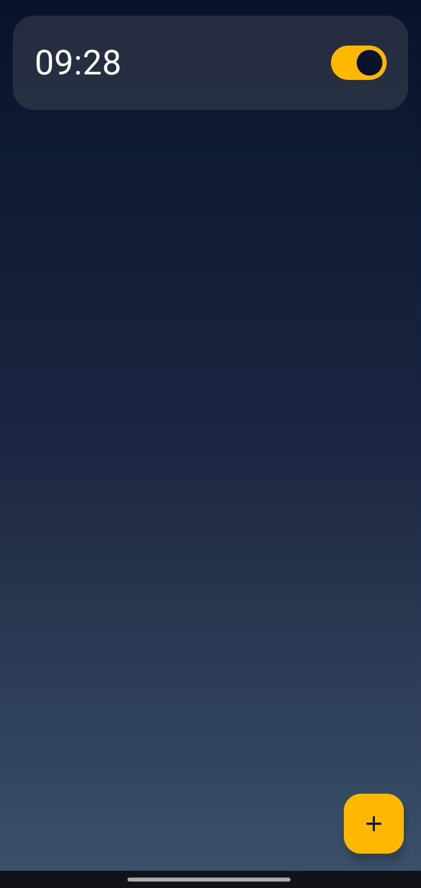
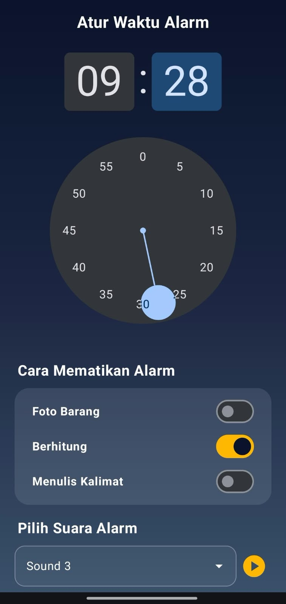
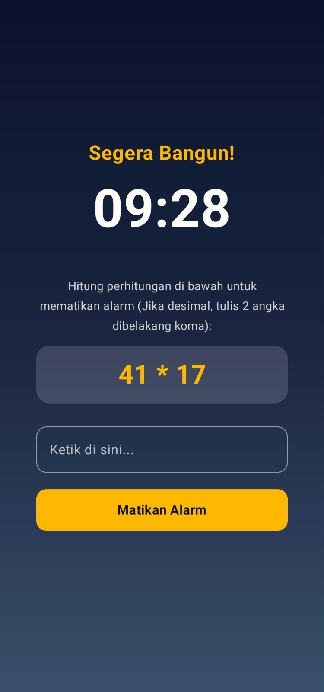

<div align="center">

# ⏰ EasyWakeUp
**An Android alarm app that forces you to wake up using interactive challenges.**

[](https://www.android.com)
[](https://kotlinlang.org)
[](https://developer.android.com/jetpack/compose)
[](LICENSE)

</div>

---

## 📖 About The App
**EasyWakeUp** is a smart alarm clock application designed for heavy sleepers. Traditional alarms are easy to snooze or swipe away, allowing you to fall right back to sleep. EasyWakeUp solves this problem by locking your phone screen and requiring you to complete real world and cognitive challenges such as solving math equations, typing sentences, or taking photos of specific household objects using AI before the loud alarm sound and vibration can be stopped.

---

## ✨ Features

- **Photo Challenge (ML Kit):** Take a picture of a specific household item (like a shoe, or chair) to dismiss the alarm.
- **Math Challenge:** Solve random math problems to turn off the alarm.
- **Writing Challenge:** Type a specific sentence accurately.
- **Local Storage:** Built with Room Database.

---

## 📱 Screenshots

|         Alarm List          |                    Alarm Setup                     |                       Challenge                       |
|:---------------------------:|:--------------------------------------------------:|:-----------------------------------------------------:|
|  |  |                  |

---

## 🎥 Video Demo

[](https://youtu.be/vADdamcTu-s?si=iaPX3M7sbIVP-5JF)

---

## 🛠️ Tech Stack
- **Language:** Kotlin
- **UI:** Jetpack Compose & Material 3
- **Architecture:** MVVM
- **Dependency Injection:** Hilt
- **Database:** Room
- **AI & Camera:** Google ML Kit & CameraX

---

## 🚀 How to Run
1. Clone this repository:
   ```bash
   git clone https://github.com/RandyNasuta/Easy-Wake-Up.git
   ```
2. Open the project in Android Studio.
3. Let Gradle sync dependencies.
4. Run the app on an emulator or physical Android device.

## 📄 License
This project is licensed under the MIT License.
